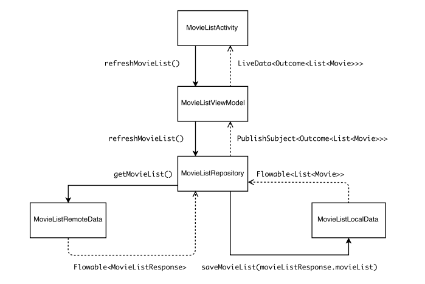

# Overview
Small, consistent Android application, built following MVVP pattern and written entirely in Kotlin. As for now, app's main feature is fetching a list of movies currently played in theaters and displaying it to user. All the data, presented by the application is provided by [themoviedb.org](https://themoviedb.org) API. Application built based on [karntrehan's](https://github.com/karntrehan) [Posts](https://github.com/karntrehan/Posts) sample app architecture.

# Presentation

# Rules applied
- **SOLID principles**
- **Single source of truth** (Room database)
- **Packaged by feature** 
- **Off-line first**

# Data Flow

# Libraries used
* Android Support Libraries
* Android Architecture Components (Room, LiveData, ViewModel)
* Dagger 2
* RxJava, RxAndroid
* Retrofit 2
* OkHttp 3
* Glide
* GSON
* JUnit
* Mockito
* Robolectric
 
# TO-DO-LIST
- **Add AAC PagingLibrary** 
- **Allow user to add choosen movie to `toWatchLater` list** 

# Run Tests
Unit tests -> `gradlew test`

Instrumented tests -> `gradlew connectedAndroidTest`

# Note
In order to run the application, You need to obtain a private `api_key` from [themoviedb.org](https://themoviedb.org) and place it in the [Constants](app/src/main/java/com/ferumate/towatch/commons/data/Constants.kt) object, as a String val named `API_KEY`.
